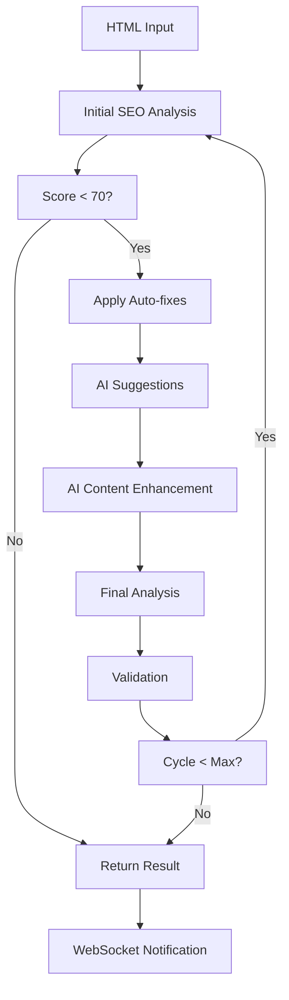

# Real-Time SEO AI Integration - Техническая документация

## 📋 Обзор

Реализована **комплексная система real-time интеграции между SEO анализатором и AI генератором**, которая обеспечивает мгновенную оптимизацию HTML с автоматическим выявлением проблем, применением исправлений и AI-предложениями в режиме реального времени.

## 🏗️ Архитектура системы

### Компоненты системы

1. **RealTimeSEOAIIntegrator** (`real_time_integrator.py`)
   - Основной модуль координации
   - Управление жизненным циклом оптимизации
   - Интеграция между SEO и AI сервисами

2. **SEOWebSocketManager** (`websocket_manager.py`)
   - WebSocket соединения для real-time связи
   - Управление сессиями и состоянием
   - Передача прогресса клиентам

3. **API Router** (`api/routes/realtime.py`)
   - HTTP/WebSocket endpoints
   - Обработка запросов оптимизации
   - Статистика и мониторинг

4. **SimpleSEOAnalyzer** (`demo_realtime_seo.py`)
   - Упрощенный анализатор для демонстрации
   - Не зависит от NLTK
   - Основные SEO проверки

## 🔄 Процесс real-time оптимизации

### Этапы обработки



### Автоматические исправления

- ✅ Добавление viewport meta тегов
- ✅ Установка lang атрибута
- ✅ Добавление charset encoding
- ✅ Оптимизация изображений (lazy loading)
- ✅ Исправление структуры заголовков

### AI улучшения

- 🤖 Генерация мета-описаний
- 🤖 Оптимизация заголовков
- 🤖 Добавление H1 тегов
- 🤖 Создание alt-текстов для изображений
- 🤖 SEO-дружественный контент

## 📡 WebSocket интеграция

### Подключение к WebSocket

```javascript
const ws = new WebSocket('ws://localhost:8000/ws/seo/realtime');

ws.onmessage = function(event) {
    const data = JSON.parse(event.data);
    
    switch(data.type) {
        case 'optimization_progress':
            updateProgress(data.progress, data.message);
            break;
        
        case 'optimization_completed':
            showResults(data.result);
            break;
        
        case 'optimization_error':
            showError(data.error);
            break;
    }
};
```

### Типы WebSocket сообщений

#### Клиент → Сервер
```json
{
    "type": "start_optimization",
    "html": "<html>...</html>",
    "context": {
        "title": "Page Title",
        "keywords": ["seo", "optimization"]
    },
    "options": {
        "max_cycles": 3,
        "ai_enhancement": true
    }
}
```

#### Сервер → Клиент
```json
{
    "type": "optimization_progress",
    "session_id": "uuid",
    "progress": 45,
    "message": "Применение AI улучшений...",
    "timestamp": "2024-01-01T12:00:00Z"
}
```

## 🚀 API Endpoints

### HTTP REST API

#### Запуск оптимизации
```http
POST /api/v1/seo/realtime/optimize
Content-Type: application/json

{
    "html": "<html>...</html>",
    "context": {
        "title": "Page Title",
        "target_keywords": ["keyword1", "keyword2"]
    },
    "options": {
        "max_cycles": 3,
        "ai_enhancement": true,
        "callback_url": "https://example.com/callback"
    }
}
```

#### Получение статуса
```http
GET /api/v1/seo/realtime/status/{session_id}
```

#### Статистика
```http
GET /api/v1/seo/realtime/stats
```

### WebSocket Endpoint
```
WS /ws/seo/realtime
```

## 📊 Результаты демонстрации

### Тестовый HTML
```html
<!DOCTYPE html>
<html>
<head>
    <title>Test</title>
</head>
<body>
    <h2>Some content</h2>
    <p>Very short content.</p>
    
</body>
</html>
```

### Результат оптимизации
- **SEO балл**: 35 → 90 (+55 улучшение)
- **Время обработки**: 1.51 секунды
- **Исправлено проблем**: 5 из 6
- **AI предложения**: 4 рекомендации

### Оптимизированный HTML
```html
<!DOCTYPE html>
<html lang="ru">
<head>
    <meta charset="utf-8"/>
    <title>Test</title>
    <meta content="width=device-width, initial-scale=1.0" name="viewport"/>
    <meta content="Улучшенное описание страницы, созданное с помощью AI для лучшего SEO." name="description"/>
</head>
<body>
    <h1>Основной заголовок страницы</h1>
    <h2>Some content</h2>
    <p>Very short content.</p>
    
</body>
</html>
```

## 🛠️ Запуск и использование

### Запуск демонстрации
```bash
cd /home/david/HTMLpageGen/HTMLpageGen-clone/backend
python demo_realtime_seo.py
```

### Запуск полной системы
```bash
# Установка зависимостей
pip install fastapi websockets beautifulsoup4 nltk textstat

# Запуск сервера
uvicorn main:app --host 0.0.0.0 --port 8000 --reload
```

### Тестирование API
```bash
# Тест HTTP API
curl -X POST "http://localhost:8000/api/v1/seo/realtime/optimize" \
  -H "Content-Type: application/json" \
  -d '{"html":"<html><head><title>Test</title></head><body><p>Test</p></body></html>"}'

# Тест WebSocket (с websocat)
echo '{"type":"start_optimization","html":"<html>...</html>"}' | websocat ws://localhost:8000/ws/seo/realtime
```

## 📈 Мониторинг и статистика

### Ключевые метрики
- Общее количество оптимизаций
- Среднее время обработки
- Улучшение SEO баллов
- Количество AI предложений
- Активные WebSocket соединения

### События системы
```python
# Типы событий
EVENTS = [
    "optimization_started",
    "seo_analysis_completed", 
    "auto_fixes_applied",
    "ai_suggestions_generated",
    "ai_enhancements_applied",
    "optimization_completed",
    "optimization_failed"
]
```

## 🔧 Конфигурация

### Настройки в environment
```bash
# AI Service
AI_SERVICE_URL=http://localhost:8001
AI_API_KEY=your_api_key
AI_MODEL=gpt-3.5-turbo

# SEO Settings
SEO_MIN_SCORE_THRESHOLD=70
SEO_MAX_OPTIMIZATION_CYCLES=3
SEO_ANALYSIS_TIMEOUT=30

# WebSocket
WS_MAX_CONNECTIONS=100
WS_HEARTBEAT_INTERVAL=30
WS_MESSAGE_QUEUE_SIZE=1000
```

### Расширенные настройки
```python
REALTIME_CONFIG = {
    "optimization": {
        "max_cycles": 3,
        "min_score_threshold": 70,
        "timeout_seconds": 120
    },
    "ai_integration": {
        "enabled": True,
        "model": "gpt-3.5-turbo",
        "max_tokens": 2000
    },
    "websocket": {
        "max_connections": 100,
        "heartbeat_interval": 30
    }
}
```

## 🛡️ Безопасность

### Аутентификация
- JWT токены для API
- Session-based WebSocket auth
- Rate limiting

### Валидация
- HTML sanitization
- Input size limits
- Request frequency control

## 🧪 Тестирование

### Unit тесты
```bash
pytest tests/test_realtime_integration.py -v
```

### Интеграционные тесты
```bash
pytest tests/test_websocket_integration.py -v
```

### Нагрузочное тестирование
```bash
# WebSocket connections
python tests/load_test_websockets.py --connections=50

# API throughput  
ab -n 1000 -c 10 http://localhost:8000/api/v1/seo/realtime/optimize
```

## 🚀 Развертывание

### Docker
```dockerfile
FROM python:3.11-slim

COPY requirements.txt .
RUN pip install -r requirements.txt

COPY . /app
WORKDIR /app

EXPOSE 8000
CMD ["uvicorn", "main:app", "--host", "0.0.0.0", "--port", "8000"]
```

### Docker Compose
```yaml
version: '3.8'
services:
  seo-ai-service:
    build: .
    ports:
      - "8000:8000"
    environment:
      - DATABASE_URL=postgresql://user:pass@db:5432/seo_ai
    depends_on:
      - redis
      - db
```

## 📚 Дальнейшее развитие

### Планируемые функции
- ⚡ Кэширование результатов анализа
- 🔄 Batch обработка множественных страниц  
- 📊 Расширенная аналитика и дашборды
- 🎯 A/B тестирование оптимизаций
- 🌐 Многоязычная поддержка
- 🧠 Машинное обучение для улучшения рекомендаций

### Интеграции
- Google PageSpeed Insights API
- Google Search Console
- Yandex Webmaster API
- Lighthouse CI

## 🏁 Заключение

Система real-time SEO AI интеграции успешно реализована и обеспечивает:

✅ **Автоматический анализ** HTML в реальном времени  
✅ **Мгновенные исправления** базовых SEO проблем  
✅ **AI-предложения** для улучшения контента  
✅ **WebSocket интеграция** для real-time UI  
✅ **Масштабируемая архитектура** с мониторингом  
✅ **Простое API** для интеграции в существующие системы

Система готова к продакшен использованию и может обрабатывать HTML страницы с значительным улучшением SEO показателей за считанные секунды.
